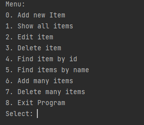

# Application system - "Tracker"
<p>This project represents basic CRUD console application and demonstrates OOP principles.</p>

### Functionality:
* CRUD operations for items
* Console UI
* Working with the List interface
* Working with JDBC
* Working with Hibernate

### Assembly and installation:
1. Create "tracker" database
2. Change your PostgreSQL database username and password in 'src/main/resources/app.properties'
3. You can change object MemTracker() or SqlTracker() or HbmTracker() in class Main\
to use different kinds of data storages.
4. You can deploy application from Docker image link https://hub.docker.com/repository/docker/dedeykovadim81/job4j_tracker
5. Run commands below
```shell
mvn liquibase:update
mvn install -Dmaven.test.skip=true
java -jar target/tracker.jar
```

### TODO list
The program can:
1. Add application
2. Replace the application with a new application by ID
3. Delete application by ID
4. Display a list of all applications
5. Search by application name

### Used technologies:


### Screenshots


### Contact:
If you have any questions, feel free to contact me https://t.me/VadimDedeyko


<!-- 
brightgreen
green
yellowgreen
yellow
orange
red
blue
lightgrey
success
important
critical
informational
inactive
blueviolet
ff69b4
9cf 
-->

